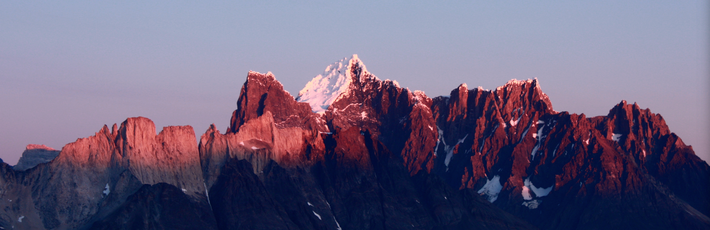

As a passionate mountaineer and climber I have begun to study atmospheric sciences to have a better understanding why weather forecasting can be challenging, and to create my own weather forecasts. Immediately, the deeper insight into science led to so many interesing fields where I wanted to know more about. 

Currently, I am doing my PhD in atmospheric sciences at the [University of Innsbruck, Austria][acinn].

[acinn]: http://acinn.uibk.ac.at
